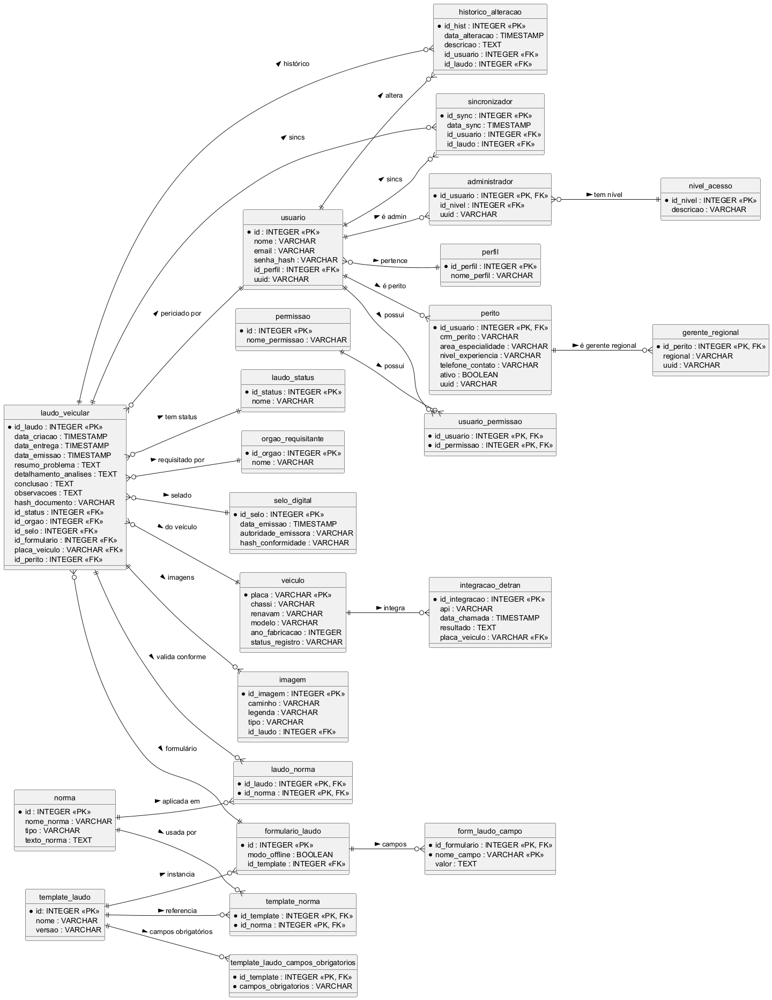

# AutoLaudo - API de Usuários

Este projeto é um sistema de geração e gerenciamento de laudos de perícia técnica, desenvolvido em Java com Spring Boot e banco de dados PostgreSQL.
Até o presente momento, a versão atual conta com o módulo usuário apenas.

---

## **Sumário**
- [Pré-requisitos](#pré-requisitos)
- [Configuração do Banco de Dados](#configuração-do-banco-de-dados)
- [Configuração do Projeto no IntelliJ IDEA](#configuração-do-projeto-no-intellij-idea)
- [Executando o Projeto](#executando-o-projeto)
- [Testando com o Postman](#testando-com-o-postman)
- [Documentação dos Endpoints](#documentação-dos-endpoints)
    - [Usuários](#usuários)
    - [Peritos](#peritos)
    - [Gerentes Regionais](#gerentes-regionais)
    - [Permissões](#permissões)
    - [Perfis](#perfis)
- [Fluxo do Módulo Usuário](#fluxo-do-módulo-usuário)
- [Modelagens e Documentação Visual](#modelagens-e-documentação-visual)


---

## **Pré-requisitos**

- **Java 21+**
- **IntelliJ IDEA** (ou similar)
- **PostgreSQL** (recomendado 13+)
- **Maven**
- **Postman** (ou Insomnia)

---

## **Configuração do Banco de Dados**

1. **Instale o PostgreSQL**:  
   - [Download PostgreSQL](https://www.postgresql.org/download/)

2. **Crie o banco de dados**:

   CREATE DATABASE sistema_autolaudo;


3. **Usuário e senha**
   Crie ou utilize um usuário, por exemplo:

   * **Usuário:** postgres
   * **Senha:** root

4. **Altere (se necessário) o arquivo `application.properties`** em `/src/main/resources`:

   ```properties
   spring.datasource.url=jdbc:postgresql://localhost:5432/sistema_autolaudo
   spring.datasource.username=postgres
   spring.datasource.password=root
   spring.datasource.driver-class-name=org.postgresql.Driver
   spring.jpa.hibernate.ddl-auto=update
   spring.jpa.show-sql=true
   ```

---

## Configuração do Projeto no IntelliJ IDEA

1. **Clone o repositório** e abra a pasta sistema-autolaudo como um projeto no IntelliJ.

2. **Certifique-se que o Lombok está instalado**:

   * No IntelliJ: `File` > `Settings` > `Plugins` > procure por `Lombok` e instale.

3. **Habilite o annotation processing**:

   * `File` > `Settings` > `Build, Execution, Deployment` > `Compiler` > `Annotation Processors`
   * Marque: `Enable annotation processing`

4. **Atualize as dependências Maven**:
   Clique com o direito no projeto > `Maven` > `Reload Project`

---

## Executando o Projeto

1. **Rode a aplicação pela IDE** ou pelo terminal:

   ```sh
   ./mvnw spring-boot:run
   ```
2. O backend estará rodando em:

   ```
   http://localhost:8080
   ```

---

## Testando com o Postman

1. **Abra o Postman** e crie uma nova requisição.
2. Configure a URL para a rota desejada (ex: `http://localhost:8080/usuarios`)
3. Para endpoints `POST`/`PUT`, selecione **Body > raw > JSON** e insira o corpo da requisição.
4. Para endpoints protegidos, configure autenticação conforme a necessidade.

---

## Documentação dos Endpoints

### Usuários

* **Criar Usuário**

  * `POST /usuarios`
  * **Body**:

    ```json
    {
      "nome": "Nome do Usuário",
      "email": "email@exemplo.com",
      "senha": "senha",
      "perfilId": 1,
      // daqui pra baixo apenas se perfil for Perito ou Gerente Regional
      "crmPerito": "123456",            
      "areaEspecialidade": "Engenharia",
      "nivelExperiencia": "Sênior",
      "telefoneContato": "11999999999"
    }
    ```
  * **Retorna**: `UsuarioResponse`

* **Listar Usuários**

  * `GET /usuarios`
  * **Retorna**: Lista de `UsuarioResponse`

* **Buscar Usuário por ID**

  * `GET /usuarios/{id}`
  * **Retorna**: `UsuarioResponse`

* **Atualizar Usuário**

  * `PUT /usuarios/{id}`
  * **Body**: igual ao criar
  * **Retorna**: `UsuarioResponse`

* **Deletar Usuário**

  * `DELETE /usuarios/{id}`

* **Listar Permissões do Usuário**

  * `GET /usuarios/{id}/permissao`
  * **Retorna**: Lista de `PermissaoResponse`

---

### Peritos

* **Listar Peritos**

  * `GET /peritos`
  * **Retorna**: Lista de `PeritoResponse`

* **Buscar Perito por ID**

  * `GET /peritos/{id}`
  * **Retorna**: `PeritoResponse` (inclui o objeto `UsuarioResponse`)

* **Promover para Gerente Regional**

  * `POST /peritos/{id}/promover-gerente`
  * **Body**:

    ```json
    { "regional": "Norte" }
    ```
  * **Retorna**: `GerenteRegionalResponse`
    (contendo objeto `PeritoResponse` + campos de gerente)

* **Rebaixar para Perito**

  * `POST /peritos/{id}/rebaixar-perito`
  * **Retorna**: `PeritoResponse`

---

### Gerentes Regionais

* **Listar Gerentes Regionais**

  * `GET /gerentes-regionais`
  * **Retorna**: Lista de `GerenteRegionalResponse`

* **Buscar Gerente Regional por ID**

  * `GET /gerentes-regionais/{id}`
  * **Retorna**: `GerenteRegionalResponse`
    (inclui o objeto `PeritoResponse` completo)

---

### Permissões

* **Listar Permissões**

  * `GET /permissoes`
  * **Retorna**: Lista de `PermissaoResponse`

---

### Perfis

* **Listar Perfis**

  * `GET /perfis`
  * **Retorna**: Lista de `PerfilResponse`

---

### Permissões de Usuários (tabela relacional)

* **Listar permissoes do usuario**
  * `GET usuarios-permissoes/usuario/{usuario_id}`
  * **Retorna**: Lista de `PermissaoUsuarioResponse` vinculadas ao usuario

* **Retirar uma permissao de um usuario**
  * `DELETE usuarios-permissoes/{usuarioId}/{permissaoId}`
 
* **Adicionar permissao a um usuario**
  * `POST usuarios-permissoes`
  * * **Body**:

    ```json
    {
      "usuario_id": 1,
      "permissao_id":2
    }
    ```
  *  **Retorna**: `PermissaoUsuarioResponse`
    
---


### Permissões

* **Listar permissões**
  * ` GET  permissoes`
  * **Retorna**: Lista de `PermissaoResponse`

 ---

 
## Exemplo de Response - UsuarioResponse

```json
{
  "id": 1,
  "uuid": "xxxx-xxxx",
  "nome": "João da Silva",
  "email": "joao@email.com",
  "Perfil": "PERITO"
}
```

---

## Fluxo do Módulo Usuário

* Ao criar um usuário, defina o perfil:

  * `perfilId = 1` — Perito: cria usuário e registro de perito, adiciona permissões específicas.
  * `perfilId = 2` — Gerente Regional: cria usuário, registro de perito, registro de gerente regional, adiciona permissões do gerente.
  * `perfilId = 3` — Administrador: cria usuário e registro de administrador.
* Permissões são ligadas automaticamente conforme perfil, e podem ser consultadas pelo endpoint `/usuarios/{id}/permissao`.
* Para promover um perito a gerente, use o endpoint `/peritos/{id}/promover-gerente` e para rebaixar, `/peritos/{id}/rebaixar-perito`.
* É possível, mesmo que um usuário seja perito, adicionar alguma(s) permissão(ões) de gerente, basta usar o endpoint `permissoes` para selecionar a permissão e depois linkar ao usuário usando ` POST permissoes-usuarios`.

---

## Dicas

* Sempre verifique o ID retornado ao criar um usuário/perito, ele será necessário para outros endpoints.
* Use o Postman para simular todos os fluxos antes de integrar com frontend ou mobile.
* Os DTOs de resposta sempre trazem as entidades aninhadas conforme relacionamento (ex: GerenteRegionalResponse traz PeritoResponse e este traz UsuarioResponse).

--- 
---
---


## Modelagens e Documentação Visual

O AutoLaudo é acompanhado de diversas modelagens visuais para apoiar o entendimento dos fluxos, regras de negócio e estrutura de dados do sistema.  
Esses diagramas são fundamentais para devs, analistas, QAs e gestores.

### Onde encontrar

Os arquivos de modelagem estão organizados em:
 /modelagens/


---

### Tipos de Diagrama e Exemplos Visuais

#### 1. **Diagrama de Casos de Uso (Use Case)**

Arquivo: `UseCases_AutoLaudo.puml`, `UseCases_AutoLaudo.png` 
Formato: PlantUML, PNG

**Descrição:**  
Apresenta as interações dos atores (usuários) com as principais funcionalidades do sistema.

**Visualização:**  


**Cenário mostrado:**  
No exemplo acima, o ator **Perito** pode criar laudos, consultar históricos e editar seus próprios laudos. O **Gerente Regional** pode, além disso, visualizar métricas da equipe e aprovar laudos. O **Administrador** tem acesso a toda a gestão de perfis, permissões e relatórios do sistema.

---

#### 2. **Diagrama Entidade-Relacionamento (ER ou ERD)**

Arquivos: `ER_AutoLaudo.puml`, `ERD_AutoLaudo.png`  
Formatos: PlantUML, PNG

**Descrição:**  
Modela as entidades do banco de dados (tabelas), seus campos e os relacionamentos (associações, chaves estrangeiras etc).

**Visualização:**  


**Cenário mostrado:**  
No diagrama acima, temos entidades como **Usuário**, **Perito**, **GerenteRegional**, **Permissão**, **Perfil** e os relacionamentos entre elas. Por exemplo, cada Usuário pode ter vários Perfis e Permissões, e há uma ligação clara entre Perito e Gerente Regional (para promoções/rebaixamentos). O diagrama serve como base para implementação e manutenção do banco de dados relacional.

---

#### 3. **Diagrama de Sequência**

Arquivo(s): `gera-sequencia-separado.puml`, que cria cada módulo de maneira separada para facilitar a visualização (`dashboard.png`, `gerenciamento de perfis.png`, `gerente.png`, `laudo.png`, `login.png`, `logout.png`e `relatorio.png`), e `gera-sequencia-unificado.puml`, que gera um grande diagrama, com tudo unificado em um arquivo só.
Formatos: PlantUML e PNG

**Descrição:**  
Mostra, passo a passo, a comunicação entre os componentes do sistema em cada fluxo (usuário → frontend → backend → banco de dados).
 
 **Visualização:**
 * **Diagramas separados por módulo**  
 Login
 Dashboard
 Laudo
 Relatorio
 Gerente
 Gerenciamento De Perfis - Admin
 Logout 
 

 * **Diagrama Unificado** 
 

**Cenário mostrado:**  
Ilustra o fluxo completo de um usuário acessando o sistema:  

1. Login/autenticação.
2. Redirecionamento ao dashboard.
3. Consulta de laudos em aberto.
4. Criação de novo laudo, incluindo etapas como autopreenchimento de dados veiculares e upload de anexos.
5. (Se gerente) Visualização e gestão de equipe.

Esse tipo de diagrama é essencial para alinhar times frontend e backend e esclarecer dúvidas sobre a ordem dos eventos e permissões.

---

### Visualização dos Diagramas

- **Arquivos `.puml`**: podem ser abertos e editados com VSCode + extensão PlantUML, IntelliJ IDEA (plugin PlantUML) ou online ([plantuml.com/plantuml/uml/](https://plantuml.com/plantuml/uml/)).
- **Arquivos `.png` ou `.svg`**: abrem em qualquer visualizador de imagens.

---

### Recomendações de Uso

- **Consulte o diagrama de casos de uso** para se familiarizar com o escopo funcional do sistema.
- **Analise o ERD** antes de propor alterações no banco de dados ou nas regras de negócio.
- **Utilize o diagrama de sequência** sempre que houver dúvidas sobre um fluxo específico ou ao criar integrações novas.

> **Sempre mantenha as modelagens atualizadas!**  
> Alterações significativas de fluxo ou entidades devem ser refletidas nos diagramas e arquivadas na mesma pasta `modelagens`.

---

# **Dúvidas?**  
Entre em contato comigo através do meu email de contato ou acesse os arquivos e exemplos.


